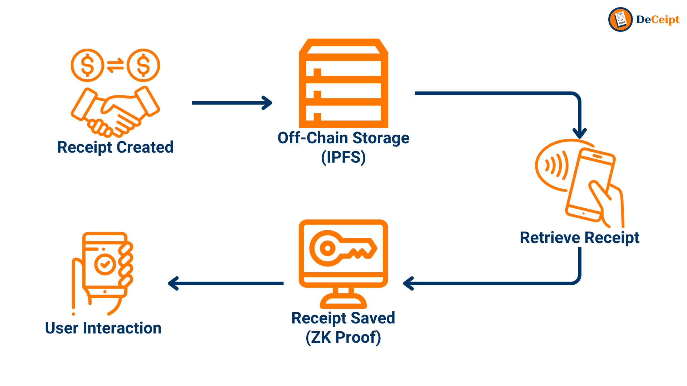

# MakeItChallenge-Hackathon-DeCeipt
DeCeipt project for Make It Challenge 2024


### Merchant Website Prototype <br>
Try it out at https://deceipt.aideyekit.com

https://github.com/DoughnutsNCookies/MakeItChallenge-Hackathon-DeCeipt/assets/53002130/6258c37f-ab47-41cc-bc0e-ad1edb24c701


### Figma Prototype <br>
Try it out at https://www.figma.com/proto/eFYogAi0h763I8DtqhRqYK/DeCeipt?node-id=61-70&t=YmjiE2a5pVXmC9am-0&scaling=min-zoom&content-scaling=fixed&page-id=0%3A1&starting-point-node-id=61%3A70


https://github.com/DoughnutsNCookies/MakeItChallenge-Hackathon-DeCeipt/assets/53002130/2a6f94f8-47f7-4f8f-801f-8d984e606afd


## How it works

### Step 1: 🖨️ Virtual Printer Integration
>When a receipt is required, DeCeipt acts as a virtual printer. Instead of printing a paper receipt, DeCeipt processes the receipt content digitally. This seamless integration makes DeCeipt appear as a regular printer to the point-of-sale (POS) system, ensuring easy adoption without changing existing workflows.

### Step 2: 📦 Off-Chain Storage
>Once DeCeipt processes the receipt content, it stores the information in an off-chain storage solution like the InterPlanetary File System (IPFS). This decentralized storage method ensures the data is secure and tamper-proof while maintaining high availability. DeCeipt generates a unique identifier (CID—Content Identifier) for the stored receipt during this process.

### Step 3: ⛓️ Blockchain Record Creation
>The unique ID generated from the off-chain storage is then recorded on the blockchain. This step ensures an immutable, verifiable record of the receipt’s existence and corresponding data location. By storing only the unique ID on-chain, we minimize blockchain storage costs while maintaining the integrity and traceability of the receipts.

### Step 4: 🤳🏻 User Interaction via QR Code or NFC
>When users want to retrieve the receipt from the merchant, they can scan a QR code or tap an NFC tag provided by the merchant through DeCeipt. This action connects the user’s digital wallet with the blockchain record, linking the receipt to the user securely and privately.

### Step 5: 🔒 Data Retrieval with Zero Knowledge Proofs (ZKP)
>DeCeipt employs Zero Knowledge Proofs (ZKP) to ensure the receipt data's privacy and security. ZKP allows data verification without revealing the data itself, ensuring that only the wallet owner can retrieve and view their receipt. This method maintains the confidentiality of the transaction details while providing verifiable proof of authenticity.
### Step 6: 📱 User-Friendly App Interface
>DeCeipt offers an optional app with a simple user interface for added convenience. This app allows users to visualize and manage their receipts effortlessly. Users can view their transaction history, categorize expenses, and prepare for tax filings, all within a secure and intuitive platform.



## Summary
DeCeipt revolutionizes receipt management by providing a digital, eco-friendly alternative to traditional paper receipts. Our solution leverages advanced technologies like blockchain, IPFS, and ZKP to ensure that receipts are securely stored, easily accessible, and only retrievable by authorized users. With DeCeipt, you don’t just save paper; you help save the planet, too.

## Building the project

Before building the project, you must install all the required dependencies. You can do so with `npm` by running the following command:

```sh
npm install
``` 

To build the server, navigate to the `demo` folder and run the following command:

```sh
npm run build
```

Once done, you can run the server with the following command:

```sh
npm run start
```

Optionally, you can run this project in developer mode using the `dev` option:

```sh
npm run dev
```
